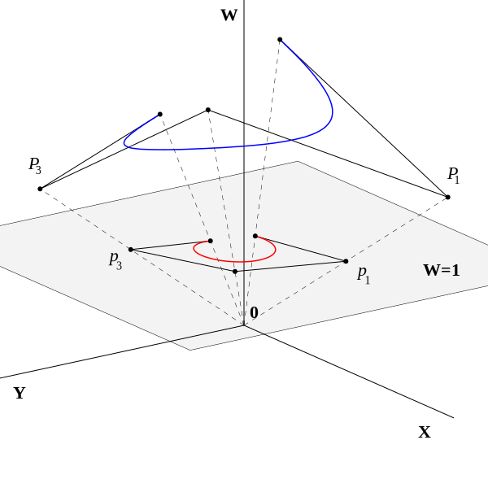
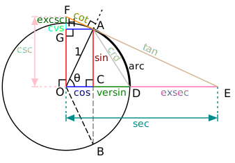
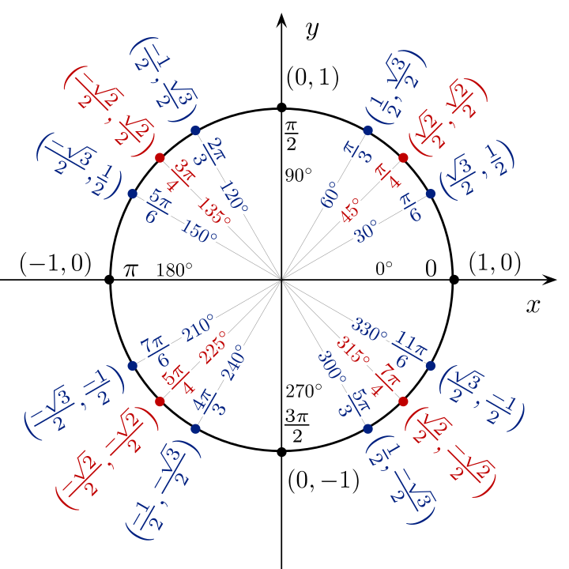

[TOC]

# Overview
Mathematics terminology

# Scalar
Scalars are quantities that are fully described by a magnitude (or numerical value) alone.

# Vector
Vectors are quantities that are fully described by both a magnitude and a direction.

# Rate of change
Rate of change play a role whenever we study the relationship between two changing quantities. Velocity is a familiar example (the rate of change of position with respect to time)

## Average rate of change
The average rate of change of y=f(x) over an interval [x0,x1]:

Average rate of change = [f(x1) - f(x0)] / [x1 - x0]

> Average rate of change is the slope of the secant line through the points (x0,f(x0)) and (x1,f(x1)) on the graph of f(x)

## Instantaneous rate of change
Instantaneous rate of change is limit of the average rates of change.

> Instantaneous rate of change is the slope of the tangent line at x0.

# Tangent lines
You can think of a tangent line as a line that skims a curve at a point.

# Secant lines
The term secant line refers to a line through two points on a curve.

# Geometry
study of shape

# Algebra
study of operations and their application to solving equations

# Calculus
study of change

# Limit
Suppose that f(x) is defined for all x in an open interval containing c (but not necessarily at x = c). Then

	lim f(x) as x approaches c equal L

if for all epsilon > 0, there exist delta > 0 such that

	|f(x) - L| < epsilon if 0 < |x - c| < delta

> Intuitively, when x approaches c then f(x) approaches L.

# Differential calculus
finding tangent lines to curves

# Integral calculus
computing areas under curves

# Cartesian coordinate
A Cartesian coordinate system is a coordinate system that specifies each point uniquely in a plane by a pair of numerical coordinates, which are the signed distances to the point from two fixed perpendicular directed lines, measured in the same unit of length.

# Homogeneous coordinate
Homogeneous coordinates are a system of coordinates used iin projective geometry, as Cartesian coordinates are used in Euclidean geometry.

# Unit circle
A unit circle is a circle with a radius of one. In trigonometry, the unit circle is the circle of radius one centered at the origin (0, 0) in the Cartesian coordinate system in the Euclidean plane.

# Hypotenuse
In geometry, a hypotenuse is the longest side of a right-angled triangle, the side opposite of the right angle.

# Trigonometric identities
Trigonometric identities are equalities that involve trigonometric functions and are true for every single value of the occurring variables where both sides of the equality are defined.

# Asymptote
An asymptote of a curve is a line such that the distance between the curve and the line approaches zero as they tend to infinity.

# Function
In mathematics, a function is a relation between a set of inputs and a set of permissible outputs with the property that each input is related to exactly one output.

## Domain
set of inputs

## Image (Range)
set of outputs

## Graph
set of all input-output pairs

## Zero (Root)
is a x value such that: f(x) = 0

## Piecewise function
f(x) = 5 if x < 0
f(x) = 6x + 7 if x = 0
f(x) = 7x if x >0

A function with definition as above is a piecewise function.

# Arithmetic
the branch of mathematics dealing with the properties and manipulation of numbers.

# Number
an arithmetical value, expressed by a word, symbol, or figure, representing a particular quantity and used in counting and making calculations and for showing order in a series or for identification.

- Natural numbers: 1,2,3,4,5,6,...
- Whole numbers = natural numbers + zero = 0,1,2,3,4,5,6,...
- Integers: negative natural numbers + whole numbers = ...,-3,-2,-1,0,1,2,3,...
- Rational numbers: ratio of integers
- Irrational numbers: the ones can't be written as fractions
- Real numbers: Irrational + Rational
- Imaginary numbers (complex numbers)

# Triangle inequality
In mathematics, the triangle inequality states that for any triangle, the sum of the lengths of any two sides must be greater than or equal to the length of the remaining side.

In Euclidean geometry and some other geometries, the triangle inequality is a theorem about distances, and it is written using vectors and vector lengths (**norms**):

||x+y|| <= ||x|| + ||y||

Absolute value: |x+y| <= |x| + |y|

# Interval
- Closed: [a,b]
- Open: (a,b)
- Half-open: [a,b) or (a,b]

# Difference quotient
Difference quotient is slope of secant line.
Formula: [f(x) - f(a)]/(x - a)

# Derivative
- Rates of change
- Slope of tangent line = limit of slopes of secant line
- Limit of a difference quotient.
	+ f'(a) = limit when x -> a of [f(x) - f(a)]/(x - a)
	+ f'(x) = limit when h -> 0 of [f(x+h) - f(x)]/h

# Differentiation
Process of computing derivative.

# Tangent line
Tangent line at P(a,f(a)) is the line through P with slope f'(a).
